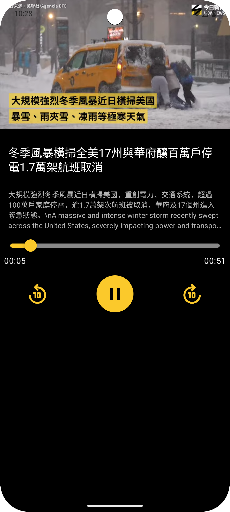
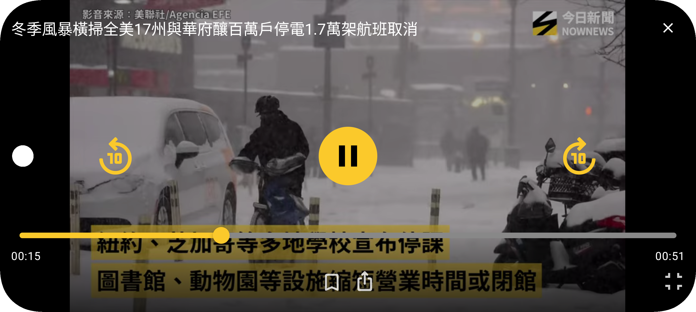

# Android YouTube Player Compose

## Giới thiệu dự án

Dự án này là một **ứng dụng phát YouTube trên Android**, tích hợp **PierfrancescoSoffritti YouTube Player Library**, trình bày đầy đủ:

> **Android + Jetpack Compose + Kiến trúc MVVM + Clean Code**  
> **Cách triển khai trình phát video tự thích ứng giữa chế độ dọc/ngang với UI được điều khiển bởi StateFlow**

---

## Demo

| Screenshot |
|---------|------------|
|  |
|  |

### Tính năng cốt lõi
* ✅ Phát video YouTube (dựa trên PierfrancescoSoffritti)
* ✅ Tự động chuyển đổi dọc/ngang và chế độ toàn màn hình
* ✅ Quản lý trạng thái phát (phát / tạm dừng / đang tải / kết thúc)
* ✅ Kéo thanh tiến trình và hiển thị thời gian
* ✅ Tua nhanh / tua lùi 10 giây
* ✅ Cơ chế tự động ẩn bảng điều khiển
* ✅ Quản lý vòng đời đầy đủ

---

## Điểm nổi bật của dự án

* ✅ Một `PlayerController` duy nhất quản lý toàn bộ trạng thái phát
* ✅ Dùng `StateFlow` để cập nhật UI theo kiểu reactive
* ✅ Hỗ trợ tự động vào chế độ toàn màn hình khi xoay ngang
* ✅ Giao diện player tùy chỉnh (phong cách Material 3)
* ✅ Hiệu ứng mượt mà (thanh tiến trình, bảng điều khiển)
* ✅ Cơ chế xử lý lỗi đầy đủ
* ✅ Phát hiện hướng vật lý của thiết bị (`OrientationEventListener`)
* ✅ Ép chuyển hướng màn hình (không bị ảnh hưởng bởi khóa xoay của hệ thống)

---

## Công nghệ sử dụng

### Stack công nghệ cốt lõi
* Kotlin
* Jetpack Compose (Material 3)
* Hilt Dependency Injection
* Coroutine / Flow / StateFlow
* Navigation Compose
* Kotlin Serialization

### Liên quan đến player
* PierfrancescoSoffritti YouTube Player 13.0.0
* AndroidView (Compose Interop)
* Lifecycle-aware Components

### Công nghệ UI/UX
* AnimatedVisibility (Fade In/Out)
* Custom Slider with Shadow Effect
* Gesture Detection (chạm để hiện/ẩn control)
* Adaptive Screen Mode (Portrait/Landscape)

```kotlin
// --- YouTube Player ---
implementation("com.pierfrancescosoffritti.androidyoutubeplayer:core:13.0.0")
````

---

## Cấu trúc dự án

```text
com.alex.yang.youtubecompose
│
├── player
│   ├── PlaybackState.kt              # Enum trạng thái phát
│   ├── PlayerController.kt           # Bộ điều khiển player
│   └── PlayerFactory.kt              # Factory tạo YouTubePlayerView
│
├── presentation
│   ├── component
│   │   ├── FullscreenPlayerPanel.kt  # Bảng điều khiển toàn màn hình
│   │   ├── PlayerSlider.kt           # Thanh tiến trình phát
│   │   └── PlayerButtons.kt          # Các nút điều khiển phát
│   │
│   ├── VideoScreen.kt                # Màn hình phát video chính
│   └── VideoViewModel.kt             # ViewModel của video
│
├── core
│   └── orientation
│       └── DeviceUtils.kt            # Công cụ phát hiện hướng thiết bị
│
├── domain
│   └── model
│       └── Video.kt                  # Model dữ liệu video
│
├── features_compose
│   └── home
│       └── presentation
│           └── HomeScreen.kt         # Trang chủ tin tức (danh sách phân loại)
│
├── ui
│   └── theme
│       └── AlexYoutubeComposeTheme.kt
│
└── MainActivity.kt
```

---

## Nguyên tắc thiết kế kiến trúc

### 1. Nguyên tắc trách nhiệm đơn nhất

* **PlayerController** - Chỉ tập trung vào quản lý trạng thái player
* **VideoScreen** - Phụ trách bố cục UI và phát hiện hướng màn hình
* **FullscreenPlayerPanel** - Xử lý tương tác trong chế độ toàn màn hình
* **DeviceUtils** - Đóng gói toàn bộ logic phát hiện hướng thiết bị

### 2. Lập trình reactive

* Dùng **StateFlow** để quản lý toàn bộ trạng thái có thể quan sát
* UI tự động cập nhật qua `collectAsStateWithLifecycle()`
* Tránh cập nhật UI thủ công, giảm lỗi không đồng bộ trạng thái

### 3. Nhận biết vòng đời

* `PlayerController` triển khai `DefaultLifecycleObserver`
* Tự động xử lý theo vòng đời của Activity/Fragment
* Ngăn rò rỉ bộ nhớ bằng cách dọn tài nguyên trong `onDestroy`

### 4. Tách biệt trách nhiệm

* UI không thao tác trực tiếp với `YouTubePlayer`
* Mọi thao tác phát đều thông qua `PlayerController`
* Logic phát hiện hướng và logic UI được tách rời hoàn toàn

---

## Mô tả luồng hoạt động cốt lõi

### 1. Luồng khởi tạo player

```kotlin
VideoScreen(video, initSecond) 
    ↓
remember { PlayerController() }  // Tạo controller
    ↓
remember { createYouTubePlayerView(...) }  // Tạo player
    ↓
YouTubePlayer.onReady()
    ↓
controller.initialize(youTubePlayer)  // Gắn player vào controller
    ↓
controller.loadVideo(videoId, initSecond)  // Tải video
```

### 2. Luồng cập nhật trạng thái phát

```kotlin
YouTubePlayer.onStateChange(state)
    ↓
controller.updatePlaybackState(state)
    ↓
_playbackState.value = PlaybackState.PLAYING  // Cập nhật StateFlow
    ↓
UI collectAsStateWithLifecycle()  // Compose tự động recompose
    ↓
Hiển thị icon phát / tạm dừng tương ứng
```

### 3. Luồng chuyển đổi dọc/ngang

```kotlin
rememberDeviceOrientation()  // Theo dõi hướng vật lý
    ↓
OrientationEventListener.onOrientationChanged(orientation)
    ↓
Xác định góc → DeviceOrientation.LANDSCAPE_LEFT/RIGHT
    ↓
isLandscape = true
    ↓
Hiển thị LandscapeLayout (chế độ toàn màn hình)
    ↓
AdaptiveScreenMode(orientation)  // Điều chỉnh system bars
    ↓
Ép Activity sang ngang + ẩn system bars
```

### 4. Luồng kéo thanh tiến trình

```kotlin
Slider.onValueChange { newPosition }
    ↓
isSeeking = true  // Đánh dấu đang kéo
seekPosition = newPosition  // Cập nhật vị trí tạm
    ↓
Slider.onValueChangeFinished
    ↓
controller.seekTo(seekPosition)  // Thực hiện nhảy đến thời gian mới
    ↓
player.seekTo(time)  // Gọi YouTube API
    ↓
isSeeking = false  // Kết thúc kéo
```

---

## Quản lý trạng thái player

### Enum `PlaybackState`

```kotlin
enum class PlaybackState {
    IDLE,        // Nhàn rỗi (chưa khởi tạo / đã giải phóng)
    READY,       // Sẵn sàng (có thể bắt đầu phát)
    BUFFERING,   // Đang tải dữ liệu
    PLAYING,     // Đang phát
    PAUSED,      // Tạm dừng
    ENDED        // Phát xong
}
```

### Các hàm cốt lõi của `PlayerController`

| Hàm                             | Mô tả                                  |
| ------------------------------- | -------------------------------------- |
| `initialize(youTubePlayer)`     | Khởi tạo instance player               |
| `loadVideo(videoId, startTime)` | Tải video được chỉ định                |
| `play()`                        | Bắt đầu phát                           |
| `pause()`                       | Tạm dừng phát                          |
| `replay()`                      | Phát lại từ đầu                        |
| `seekTo(time)`                  | Nhảy đến thời điểm chỉ định            |
| `seekBackward(seconds)`         | Tua lùi (mặc định 10 giây)             |
| `seekForward(seconds)`          | Tua nhanh (mặc định 10 giây)           |
| `updateCurrentSecond(second)`   | Cập nhật thời gian hiện tại (callback) |
| `updateDuration(duration)`      | Cập nhật tổng thời lượng (callback)    |
| `updatePlaybackState(state)`    | Cập nhật trạng thái phát (callback)    |

---

## Phát hiện hướng và điều khiển toàn màn hình

### 1. Phát hiện hướng vật lý

Dùng `OrientationEventListener` để lắng nghe góc của thiết bị:

```kotlin
0° ± 45°    → PORTRAIT          (màn hình dọc)
90° ± 45°   → LANDSCAPE_RIGHT   (màn hình ngang bên phải)
180° ± 45°  → PORTRAIT_REVERSE  (dọc ngược)
270° ± 45°  → LANDSCAPE_LEFT    (màn hình ngang bên trái)
```

### 2. Chế độ màn hình thích ứng

```kotlin
AdaptiveScreenMode(orientation)
```

**Khi ở ngang:**

1. Ép Activity chuyển sang chế độ ngang
2. Ẩn thanh trạng thái và thanh điều hướng (toàn màn hình)
3. Cho phép vuốt cạnh để tạm hiện system bars

**Khi ở dọc:**

1. Ép Activity chuyển sang chế độ dọc
2. Hiện thanh trạng thái và thanh điều hướng như bình thường

### 3. Thoát toàn màn hình thủ công

```kotlin
context.forcePortraitOrientation()
```

Dùng khi bấm nút “thoát toàn màn hình” để ép quay về màn hình dọc.

---

## Cấu hình YouTube Player

### `IFramePlayerOptions`

```kotlin
IFramePlayerOptions.Builder(context)
    .controls(0)       // Ẩn điều khiển gốc
    .rel(0)            // Không hiển thị video liên quan khi phát xong
    .ccLoadPolicy(0)   // Không tự động tải phụ đề
    .build()
```

### Callback lắng nghe

```kotlin
AbstractYouTubePlayerListener()
    .onReady()              // Player đã sẵn sàng
    .onCurrentSecond()      // Cập nhật thời gian hiện tại mỗi giây
    .onVideoDuration()      // Lấy tổng thời lượng video
    .onStateChange()        // Trạng thái phát thay đổi
    .onError()              // Lỗi phát video
```

---

## Hướng mở rộng trong tương lai

### Mở rộng tính năng

* 🔹 Điều chỉnh tốc độ phát (0.25x ~ 2x)
* 🔹 Chọn chất lượng video (Auto / 720p / 1080p)
* 🔹 Bật/tắt phụ đề và chọn ngôn ngữ
* 🔹 Tính năng lưu video yêu thích
* 🔹 Cast lên TV

### Tối ưu kỹ thuật

* 🔹 Tải trước video tiếp theo
* 🔹 Quản lý pool instance player
* 🔹 Theo dõi trạng thái mạng (tự điều chỉnh chất lượng)
* 🔹 Chiến lược retry khi gặp lỗi

### Cải thiện UI/UX

* 🔹 Điều khiển bằng cử chỉ (vuốt chỉnh âm lượng / độ sáng)
* 🔹 Double tap để tua nhanh / tua lùi
* 🔹 Nhấn giữ để phát tốc độ cao

---

## Giấy phép và tham chiếu

### YouTube Player Library

Dự án này sử dụng [PierfrancescoSoffritti/android-youtube-player](https://github.com/PierfrancescoSoffritti/android-youtube-player)

Giấy phép: MIT License

### Giới hạn khi dùng YouTube API

* Phải tuân thủ [YouTube Terms of Service](https://www.youtube.com/t/terms)
* Không được tải video
* Không được loại bỏ quảng cáo
* Phải giữ nhận diện thương hiệu YouTube

---

## Tác giả

**Alex Yang**
Senior Android Engineer
GitHub: [https://github.com/m9939418](https://github.com/m9939418)

---

## ⭐ Nếu dự án này hữu ích với bạn, hãy cho một Star nhé

```

Nếu bạn muốn, mình có thể làm luôn bản **trau chuốt lại cho tự nhiên hơn kiểu README tiếng Việt dành cho GitHub**, không chỉ dịch sát nghĩa mà còn đọc mượt hơn.
```
