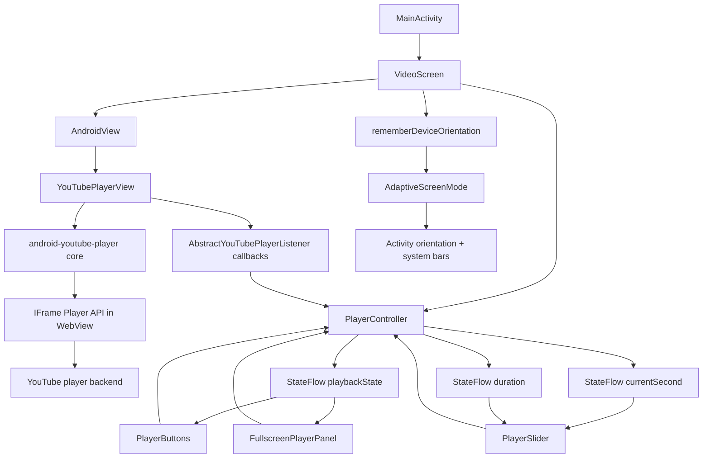
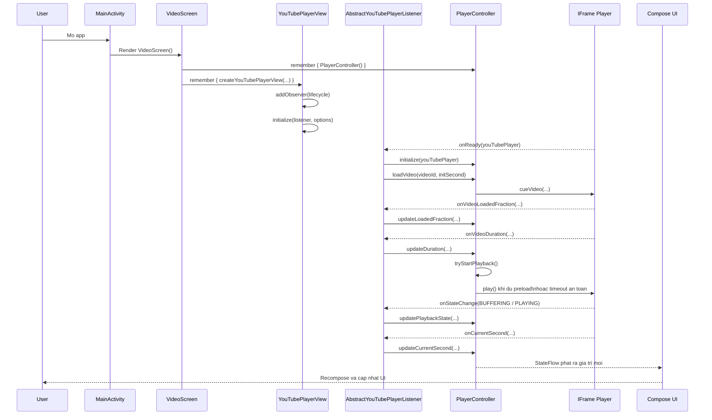
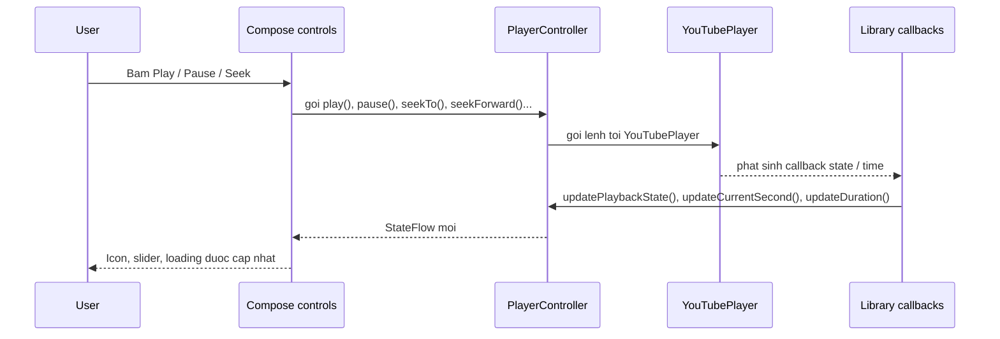
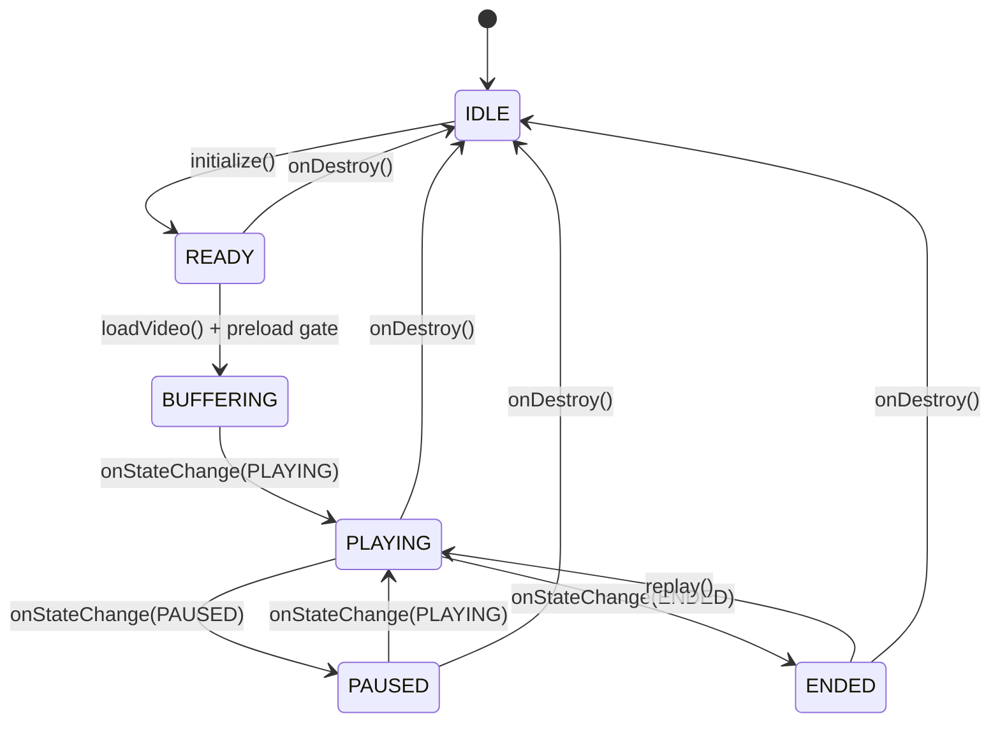
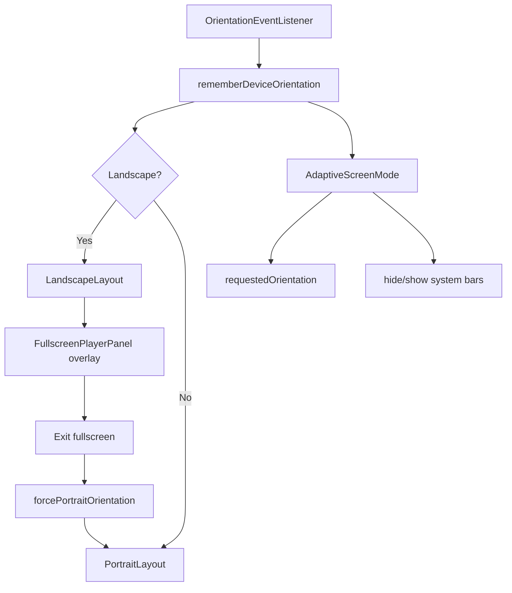

# Tai lieu kien truc module YouTube Player

Tai lieu nay mo ta kien truc, so do hoat dong, co che van hanh va ban chat cua phan player trong repo `YoutubeCompose`.

Pham vi:
- Gradle module hien tai chi co `:app`.
- "Module player" duoc hieu la cum package `player`, `presentation`, `core/orientation` va cach chung duoc ghep lai trong `VideoScreen`.

## 1. Tong quan nhanh

Repo nay khong dong goi player thanh Android library module rieng, nhung ve mat kien truc no da tach ro cac vai tro:
- `player/`: cau noi giua app va `android-youtube-player`
- `presentation/`: Compose UI va tuong tac nguoi dung
- `core/orientation/`: fullscreen, system bars, xoay man hinh
- `domain/model/`: du lieu `Video`

Code tham chieu:
- [`PlayerController.kt`](../app/src/main/java/com/alex/yang/youtubecompose/player/PlayerController.kt)
- [`PlaybackPreloadConfig.kt`](../app/src/main/java/com/alex/yang/youtubecompose/player/PlaybackPreloadConfig.kt)
- [`PlayerFactory.kt`](../app/src/main/java/com/alex/yang/youtubecompose/player/PlayerFactory.kt)
- [`VideoScreen.kt`](../app/src/main/java/com/alex/yang/youtubecompose/presentation/VideoScreen.kt)
- [`DeviceUtils.kt`](../app/src/main/java/com/alex/yang/youtubecompose/core/orientation/DeviceUtils.kt)

## 2. Ban chat cua library `android-youtube-player`

Library dang duoc dung trong repo la:

```kotlin
implementation("com.pierfrancescosoffritti.androidyoutubeplayer:core:13.0.0")
```

Ban chat cua no:
- Day khong phai native media player nhu `ExoPlayer`.
- Day cung khong phai YouTube Android Player API cu cua Google.
- Day la mot lop boc quanh YouTube IFrame Player API, chay ben trong `WebView`, va cung cap interface Kotlin/Java de dieu khien player theo kieu native.

He qua truc tiep cua ban chat nay:
- App khong phat stream YouTube bang pipeline media native cua Android.
- App dang dieu khien mot web player cua YouTube thong qua bridge native <-> WebView <-> IFrame.
- Cac thao tac doc state co the bat dong bo vi state that su nam trong IFrame player.
- Viec tuy bien UI rat linh hoat: co the tat control goc cua IFrame va de native UI cua app de len tren.
- Van phai ton trong YouTube Terms of Service: khong tai video, khong loai bo quang cao, khong lam background playback neu muon len Play Store.

Tai sao repo nay chon cach nay:
- `android-youtube-player` cho Android mot diem vao don gian la `YouTubePlayerView`.
- `YouTubePlayerView` co tinh lifecycle-aware.
- De ket hop voi Compose, repo chi can boc no bang `AndroidView`.

Nguon chinh thuc:
- Official repo: https://github.com/PierfrancescoSoffritti/android-youtube-player
- API docs / README: https://github.com/PierfrancescoSoffritti/android-youtube-player
- Release `13.0.0`: https://github.com/PierfrancescoSoffritti/android-youtube-player/releases/tag/13.0.0

## 3. Kien truc trong repo

### 3.1 So do lop kien truc



### 3.2 Phan tach trach nhiem

| Thanh phan | Vai tro |
| --- | --- |
| `MainActivity` | Khoi dong UI va render `VideoScreen` |
| `VideoScreen` | To chuc man hinh, tao controller, tao player view, chon portrait/landscape |
| `PlayerController` | Trung tam state va lenh dieu khien player |
| `createYouTubePlayerView` | Khoi tao `YouTubePlayerView`, bind lifecycle, dang ky callback |
| `PlayerButtons` | Play, pause, replay, tua nhanh, tua lui |
| `PlayerSlider` | Hien thi tien do, seek theo vi tri nguoi dung chon |
| `FullscreenPlayerPanel` | Overlay dieu khien khi fullscreen |
| `DeviceUtils` | Theo doi huong thiet bi, ep orientation, an/hien system bars |

## 4. Luong khoi tao player



Y nghia:
- `VideoScreen` chi tao mot `PlayerController` va mot `YouTubePlayerView` bang `remember`.
- `PlayerController` giu reference `YouTubePlayer` sau khi `onReady`.
- `PlayerController` khong goi `loadVideo()` truc tiep nua, ma `cueVideo()` truoc de co mot lop preload gate cho lan autoplay dau.
- Tu thoi diem do, UI khong noi chuyen truc tiep voi player nua. Moi lenh di qua `PlayerController`.

## 5. Luong tuong tac khi nguoi dung dieu khien



Ban chat cua co che nay:
- UI gui lenh theo huong xuong.
- Player callback ket qua theo huong nguoc len.
- `StateFlow` la lop dong bo trung gian de Compose khong phai "doc" truc tiep tu player.

## 6. Cac phuong thuc van hanh chinh

### 6.1 Nhom lenh dieu khien

| Ham | Khi nao duoc goi | Muc dich |
| --- | --- | --- |
| `initialize(youTubePlayer)` | `onReady()` | Giu instance player va chuyen sang `READY` |
| `loadVideo(videoId, startTime)` | Sau `initialize` | `cue` video, mo preload gate va chi autoplay khi du dieu kien |
| `play()` | Tu nut Play hoac replay xong | Tiep tuc phat |
| `pause()` | Tu nut Pause | Tam dung |
| `replay()` | Khi state la `ENDED` | Seek ve 0 va phat lai |
| `seekTo(time)` | Khi keo slider | Nhay den vi tri mong muon |
| `seekBackward(seconds)` | Tu nut tua lui | Lui lai, mac dinh 10 giay |
| `seekForward(seconds)` | Tu nut tua toi | Tien len, mac dinh 10 giay |

### 6.2 Nhom cap nhat state

| Ham | Nguon goi | Y nghia |
| --- | --- | --- |
| `updateCurrentSecond(second)` | `onCurrentSecond()` | Dong bo thoi gian hien tai |
| `updateDuration(duration)` | `onVideoDuration()` | Dong bo tong thoi luong |
| `updateLoadedFraction(loadedFraction)` | `onVideoLoadedFraction()` | Dong bo phan tram du lieu da nap |
| `updatePlaybackState(state)` | `onStateChange()` | Chuyen state web player sang state noi bo cua app |

### 6.3 Co che preload de xem muot hon

YouTube IFrame API khong cho set truc tiep kieu "buffer truoc 10 giay", vi vay repo nay dung mot chien luoc mem trong `PlayerController`:

1. Khi player `onReady`, app khong autoplay ngay ma goi `cueVideo(videoId, startTime)`.
2. `PlayerController` theo doi `onVideoLoadedFraction()` va `onVideoDuration()`.
3. Neu uoc tinh da nap du `minBufferedSeconds`, app moi goi `play()`.
4. Neu YouTube khong gui du metadata/callback som, app se fallback sau `maxPreloadWaitMs` de tranh treo o loading qua lau.

Gia tri mac dinh hien tai nam trong [`PlaybackPreloadConfig.kt`](../app/src/main/java/com/alex/yang/youtubecompose/player/PlaybackPreloadConfig.kt):

```kotlin
PlaybackPreloadConfig(
    minBufferedSeconds = 8f,
    minBufferedFraction = 0.03f,
    maxPreloadWaitMs = 2_500L,
)
```

Y nghia:
- `minBufferedSeconds`: so giay muon co truoc khi autoplay.
- `minBufferedFraction`: fallback khi duration chua co.
- `maxPreloadWaitMs`: gioi han cho de khong doi qua lau neu callback cua YouTube den cham.

Day la heuristic de giam hien tuong vua vao video da bi khung hinh dau roi dung lai de buffering. No khong bien IFrame player thanh ExoPlayer, nhung thuong giup trai nghiem on dinh hon.

### 6.4 State machine noi bo



Map state hien tai cua app:
- `IDLE`: chua san sang hoac da giai phong
- `READY`: player da san sang, co the load/phat
- `BUFFERING`: YouTube dang nap du lieu
- `PLAYING`: dang phat
- `PAUSED`: tam dung
- `ENDED`: phat xong

## 7. Co che fullscreen va xoay man hinh

Repo nay khong dung fullscreen toggle co san cua lib. Thay vao do no tu quan ly fullscreen bang orientation va system bars.



Y nghia kien truc:
- Fullscreen la mot quyet dinh cua app, khong phai cua web player.
- Player view van la cung mot instance, chi co UI xung quanh thay doi.
- Cach nay phu hop Compose hon vi app kiem soat toan bo overlay.

## 8. Tai sao `AndroidView` la diem then chot

`android-youtube-player` cung cap `YouTubePlayerView` theo he View truyen thong.
Compose khong render truc tiep `View` do, nen repo phai dung:

```kotlin
AndroidView(factory = { playerView })
```

Noi cach khac:
- Player that su van la Android `View`.
- Compose chi dang host lai `View` nay trong cay UI Compose.
- Day la ly do `createYouTubePlayerView(...)` va `remember { ... }` la quan trong, de tranh tao lai player moi sau moi lan recomposition.

## 9. Ban chat "custom UI" trong repo nay

Repo dang ap dung dung tinh than ma official library khuyen nghi:
- Tat control mac dinh cua IFrame bang `controls(0)`.
- Tu viet UI native de len tren player.
- Dung callback cua player de dong bo UI.

Trong repo:
- Portrait dung `PlayerSlider` va `PlayerButtons`
- Landscape dung `FullscreenPlayerPanel`

Do do, phan "player" va phan "UI" da tach tuong doi ro:
- Library chiu trach nhiem render video YouTube va phat callback
- App chiu trach nhiem UX, layout, fullscreen, gesture, icon, slider

## 10. Vong doi va giai phong tai nguyen

`YouTubePlayerView` duoc add vao lifecycle owner, nen thu vien co the tu xu ly mot phan vong doi.

Co che hien tai:
- `createYouTubePlayerView(...)` dang `addObserver(this)` cho `YouTubePlayerView`
- `VideoScreen` dang `addObserver(controller)` cho `PlayerController`
- Khi `onDestroy`, `PlayerController` xoa reference `player`, reset state ve `IDLE`

Y nghia:
- App tranh giu tham chieu player sau khi man hinh bi huy
- UI quay ve state sach
- Lifecycle-aware behavior cua library duoc tan dung dung cach

## 11. Gioi han va danh doi

### 11.1 Diem manh

- Tich hop nhanh vao Android app
- Khong phu thuoc YouTube app tren may nguoi dung
- De tuy bien UI native
- Phu hop voi Compose thong qua `AndroidView`
- Lifecycle-aware, giam kha nang ro ri tai nguyen

### 11.2 Gioi han

- Khong phai native stream player nen khong co muc do kiem soat nhu ExoPlayer
- Hanh vi phu thuoc vao IFrame player cua YouTube
- Kha nang custom bi gioi han boi nhung gi IFrame API cho phep
- Co che preload moi chi la heuristic dua tren `loadedFraction`, khong phai real buffer-length API
- Cac thao tac doc state co tinh bat dong bo tu nhien
- Phai tuan thu ToS cua YouTube

### 11.3 He qua kien truc cho repo nay

- `PlayerController` la lop on dinh hoa state cho Compose
- `StateFlow` la lop cach ly giua web player va UI
- Chien luoc "xem muot hon" nam o `PlaybackPreloadConfig` va preload gate trong `PlayerController`
- Fullscreen phai do app tu quan ly
- Neu sau nay tach thanh reusable library module, `PlayerController` va `createYouTubePlayerView` nen la hat nhan dau tien duoc tach ra

## 12. Mau tich hop toi thieu

Neu muon dung lai co che hien tai o screen khac, mau tich hop toi thieu la:

1. Tao `PlayerController` bang `remember`.
2. Tao `YouTubePlayerView` bang `remember { createYouTubePlayerView(...) }`.
3. Dung `AndroidView` de host player.
4. Dung `collectAsStateWithLifecycle()` de nghe `playbackState`, `currentSecond`, `duration`.
5. Neu muon doi muc preload, chinh `PlaybackPreloadConfig`.
6. Tat controls cua IFrame va de UI native cua app len tren.
7. Neu can fullscreen, de app tu quan ly orientation va system bars.

## 13. De xuat neu muon nang cap thanh library noi bo

Neu muc tieu tiep theo la bien cum nay thanh "library module" tai su dung trong nhieu app/man hinh, huong tach hop ly la:
- Tao module moi: `youtube-player-compose`
- Dua vao do:
  - `PlayerController`
  - `PlaybackState`
  - `createYouTubePlayerView`
  - `PlayerSlider`
  - `PlayerButtons`
  - fullscreen/orientation abstractions
- Giu `Video` va logic business ben ngoai library
- Expose API o muc:
  - `YoutubePlayerState`
  - `YoutubePlayerActions`
  - `YoutubePlayerScreen(...)`

## 14. Ket luan

Repo nay su dung `android-youtube-player` theo dung mo hinh manh nhat cua no:
- dung `YouTubePlayerView` lam player engine
- tat web controls
- viet native Compose UI de dieu khien
- dong bo state qua `PlayerController` va `StateFlow`
- de app tu giai bai toan fullscreen, orientation va UX

Ve ban chat, day la mot web-based YouTube player duoc "native hoa" interface, chu khong phai native decoder/player. Toan bo kien truc hien tai cua repo da duoc thiet ke dung theo ban chat do.
