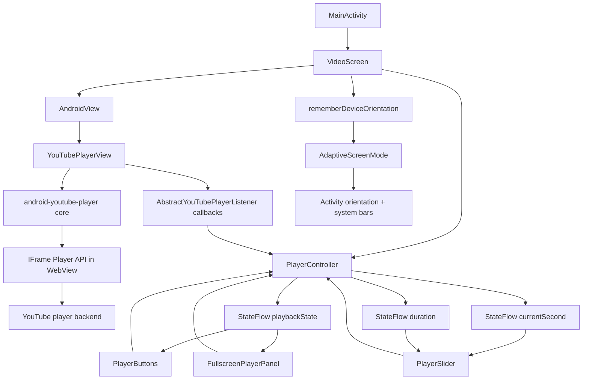
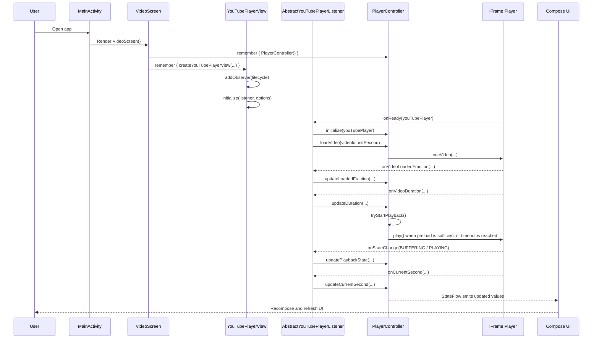
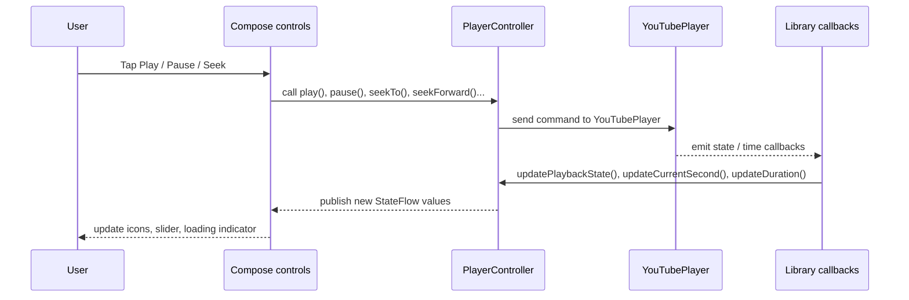
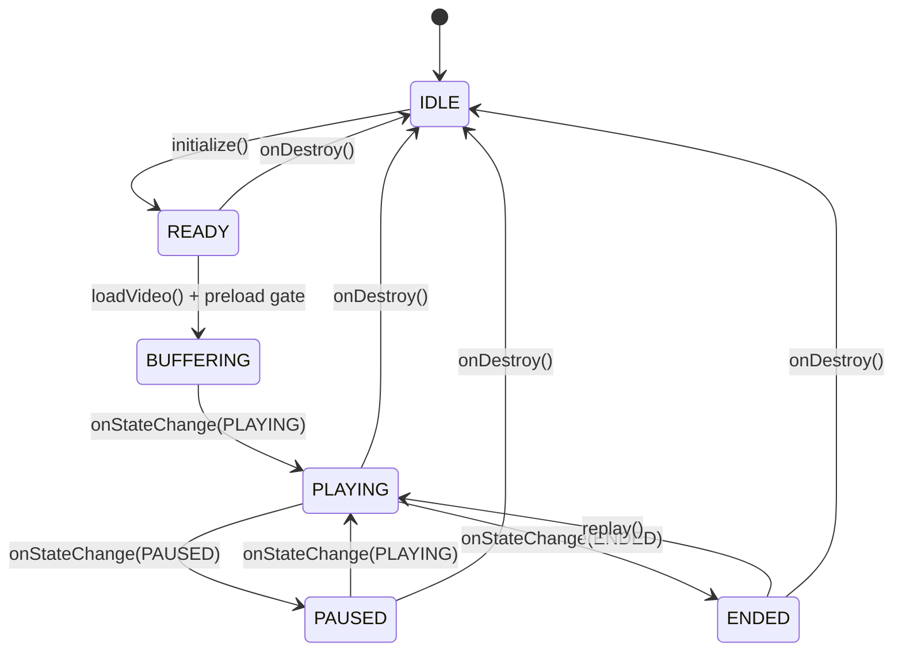
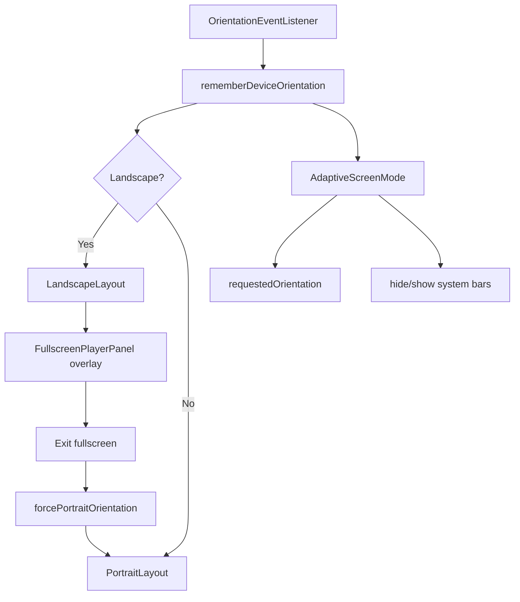

# YouTube Player Module Architecture

This document explains the architecture, data flow, operating model, and technical nature of the player layer inside the `YoutubeCompose` repository.

Scope:
- The project currently uses only the `:app` Gradle module.
- The "player module" in this document refers to the `player`, `presentation`, and `core/orientation` packages working together through `VideoScreen`.

## 1. Quick Overview

The repo does not package the player as a separate Android library module, but the responsibilities are already clearly separated:

- `player/`: bridge between the app and `android-youtube-player`
- `presentation/`: Compose UI and user interaction
- `core/orientation/`: fullscreen, system bars, and screen orientation logic
- `domain/model/`: `Video` data model

Code references:
- [`PlayerController.kt`](../app/src/main/java/com/alex/yang/youtubecompose/player/PlayerController.kt)
- [`PlaybackPreloadConfig.kt`](../app/src/main/java/com/alex/yang/youtubecompose/player/PlaybackPreloadConfig.kt)
- [`PlayerFactory.kt`](../app/src/main/java/com/alex/yang/youtubecompose/player/PlayerFactory.kt)
- [`VideoScreen.kt`](../app/src/main/java/com/alex/yang/youtubecompose/presentation/VideoScreen.kt)
- [`DeviceUtils.kt`](../app/src/main/java/com/alex/yang/youtubecompose/core/orientation/DeviceUtils.kt)

## 2. Nature of `android-youtube-player`

The library used in this repo is:

```kotlin
implementation("com.pierfrancescosoffritti.androidyoutubeplayer:core:13.0.0")
```

What it actually is:

- It is **not** a native media player like `ExoPlayer`.
- It is **not** the legacy Google YouTube Android Player API.
- It is a wrapper around the **YouTube IFrame Player API**, running inside a `WebView`, while exposing a Kotlin/Java interface that feels native.

Direct consequences:

- The app does not play YouTube streams through Android's native media pipeline.
- The app is controlling a YouTube web player through a native <-> WebView <-> IFrame bridge.
- State reads are naturally asynchronous because the real playback state lives inside the IFrame player.
- UI customization is flexible because the default IFrame controls can be disabled and replaced with native UI.
- The app must still respect YouTube Terms of Service: no downloading, no ad removal, and no forbidden background playback behavior.

Why this repo uses it:

- `android-youtube-player` provides a simple Android entry point with `YouTubePlayerView`.
- `YouTubePlayerView` is lifecycle-aware.
- Compose can host it with `AndroidView`.

Primary references:

- Official repo: https://github.com/PierfrancescoSoffritti/android-youtube-player
- API docs / README: https://github.com/PierfrancescoSoffritti/android-youtube-player
- Release `13.0.0`: https://github.com/PierfrancescoSoffritti/android-youtube-player/releases/tag/13.0.0

## 3. Repository Architecture

### 3.1 Layer Diagram



### 3.2 Responsibility Split

| Component | Responsibility |
| --- | --- |
| `MainActivity` | Starts the UI and renders `VideoScreen` |
| `VideoScreen` | Organizes screen layout, creates the controller and player view, switches between portrait and landscape |
| `PlayerController` | Central state holder and command layer for the player |
| `createYouTubePlayerView` | Creates `YouTubePlayerView`, binds lifecycle, registers callbacks |
| `PlayerButtons` | Play, pause, replay, fast-forward, rewind |
| `PlayerSlider` | Displays progress and lets the user seek |
| `FullscreenPlayerPanel` | Fullscreen overlay controls |
| `DeviceUtils` | Tracks device orientation, forces orientation, hides and shows system bars |

## 4. Player Initialization Flow



Meaning:

- `VideoScreen` creates exactly one `PlayerController` and one `YouTubePlayerView` with `remember`.
- `PlayerController` stores the `YouTubePlayer` reference after `onReady`.
- `PlayerController` no longer calls `loadVideo()` directly on the IFrame player. It calls `cueVideo()` first to apply a startup preload gate.
- From that point on, the UI does not talk to the player directly. All commands go through `PlayerController`.

## 5. User Interaction Flow



The nature of this mechanism:

- UI sends commands downward.
- Player callbacks return state upward.
- `StateFlow` acts as the synchronization layer so Compose never has to read directly from the player.

## 6. Main Operating APIs

### 6.1 Command Functions

| Function | When it is used | Purpose |
| --- | --- | --- |
| `initialize(youTubePlayer)` | `onReady()` | Store the player instance and move to `READY` |
| `loadVideo(videoId, startTime)` | After `initialize` | `cue` the video, start the preload gate, and autoplay only when conditions are met |
| `play()` | Play button or resume flow | Continue playback |
| `pause()` | Pause button | Pause playback |
| `replay()` | When the state is `ENDED` | Seek to `0` and play again |
| `seekTo(time)` | Slider seek | Jump to a target position |
| `seekBackward(seconds)` | Rewind button | Move backward, default 10 seconds |
| `seekForward(seconds)` | Forward button | Move forward, default 10 seconds |

### 6.2 State Update Functions

| Function | Trigger source | Meaning |
| --- | --- | --- |
| `updateCurrentSecond(second)` | `onCurrentSecond()` | Synchronize current playback time |
| `updateDuration(duration)` | `onVideoDuration()` | Synchronize total duration |
| `updateLoadedFraction(loadedFraction)` | `onVideoLoadedFraction()` | Synchronize buffered percentage |
| `updatePlaybackState(state)` | `onStateChange()` | Map web player state to app playback state |

### 6.3 Smoother Startup Preload

The YouTube IFrame API does not expose a direct "buffer 10 seconds ahead" configuration. Because of that, this repo uses a soft strategy inside `PlayerController`:

1. When the player becomes ready, the app does **not** autoplay immediately. It calls `cueVideo(videoId, startTime)`.
2. `PlayerController` listens to `onVideoLoadedFraction()` and `onVideoDuration()`.
3. Once the estimated buffered content reaches `minBufferedSeconds`, the app calls `play()`.
4. If YouTube does not deliver enough metadata or callbacks quickly, the app falls back after `maxPreloadWaitMs` to avoid getting stuck on loading for too long.

Current defaults are defined in [`PlaybackPreloadConfig.kt`](../app/src/main/java/com/alex/yang/youtubecompose/player/PlaybackPreloadConfig.kt):

```kotlin
PlaybackPreloadConfig(
    minBufferedSeconds = 8f,
    minBufferedFraction = 0.03f,
    maxPreloadWaitMs = 2_500L,
)
```

Meaning:

- `minBufferedSeconds`: the desired buffered time before autoplay
- `minBufferedFraction`: fallback threshold when duration is still unknown
- `maxPreloadWaitMs`: maximum wait before forced playback start

This is a heuristic to reduce the "start immediately, then freeze into buffering" behavior. It does not turn the IFrame player into ExoPlayer, but it often improves startup smoothness.

### 6.4 Internal State Machine



Current app-side state meanings:

- `IDLE`: not ready yet or already released
- `READY`: initialized and ready for playback commands
- `BUFFERING`: waiting for more data
- `PLAYING`: actively playing
- `PAUSED`: temporarily paused
- `ENDED`: playback completed

## 7. Fullscreen and Orientation Handling

This repo does not use the library's built-in fullscreen toggle. Instead, fullscreen is managed by the app through orientation and system bars.



Architectural meaning:

- Fullscreen is an app decision, not a web player decision.
- The player view remains the same instance. Only the surrounding UI changes.
- This fits Compose better because the app fully owns the overlay and layout transitions.

## 8. Why `AndroidView` Is Critical

`android-youtube-player` provides `YouTubePlayerView` in the traditional Android View system.
Compose cannot render it directly, so the repo uses:

```kotlin
AndroidView(factory = { playerView })
```

In other words:

- The actual player is still an Android `View`
- Compose simply hosts that `View` inside the Compose tree
- This is why `createYouTubePlayerView(...)` and `remember { ... }` are critical: they prevent creating a new player instance on every recomposition

## 9. Custom UI Strategy in This Repo

The repo follows the customization model recommended by the library:

- Disable the default IFrame controls with `controls(0)`
- Render a custom native UI on top of the player
- Keep the custom UI synchronized through player callbacks

In this repo:

- Portrait mode uses `PlayerSlider` and `PlayerButtons`
- Landscape mode uses `FullscreenPlayerPanel`

That means the player layer and the UI layer are clearly separated:

- The library renders the YouTube video and emits callbacks
- The app owns UX, layout, fullscreen, gestures, icons, and slider behavior

## 10. Lifecycle and Resource Cleanup

`YouTubePlayerView` is attached to the lifecycle owner, so the library can manage part of the lifecycle behavior automatically.

Current mechanism:

- `createYouTubePlayerView(...)` registers `YouTubePlayerView` as a lifecycle observer
- `VideoScreen` registers `PlayerController` as a lifecycle observer
- In `onDestroy`, `PlayerController` clears the player reference and resets state to `IDLE`

Why it matters:

- The app avoids keeping stale references after the screen is destroyed
- UI returns to a clean state
- The lifecycle-aware behavior of the library is used correctly

## 11. Limits and Tradeoffs

### 11.1 Strengths

- Fast integration into an Android app
- Does not depend on the YouTube app being installed
- Easy to customize with native UI
- Works well with Compose through `AndroidView`
- Lifecycle-aware, reducing the risk of leaks

### 11.2 Limitations

- Not a native stream player, so control is lower than with ExoPlayer
- Behavior depends on the YouTube IFrame player
- Customization is limited by what the IFrame API allows
- The preload mechanism is only a heuristic based on `loadedFraction`, not a real buffer-length API
- Reading state is naturally asynchronous
- The app must comply with YouTube Terms of Service

### 11.3 Architectural Consequences

- `PlayerController` acts as the stabilizing layer for Compose state
- `StateFlow` isolates the UI from the web player
- The smoother playback strategy lives in `PlaybackPreloadConfig` and the preload gate inside `PlayerController`
- Fullscreen must be managed by the app
- If this is later extracted into a reusable internal module, `PlayerController` and `createYouTubePlayerView` should be the first pieces to move

## 12. Minimal Integration Pattern

To reuse the current mechanism in another screen:

1. Create `PlayerController` with `remember`
2. Create `YouTubePlayerView` with `remember { createYouTubePlayerView(...) }`
3. Use `AndroidView` to host the player
4. Observe `playbackState`, `currentSecond`, and `duration` with `collectAsStateWithLifecycle()`
5. Adjust preload thresholds through `PlaybackPreloadConfig` if needed
6. Disable the default IFrame controls and render native UI above the player
7. If fullscreen is needed, let the app own orientation and system bar control

## 13. Suggested Extraction Path for an Internal Library

If the next goal is to turn this cluster into a reusable internal library module across multiple apps or screens, the clean split would be:

- Create a new module: `youtube-player-compose`
- Move into it:
  - `PlayerController`
  - `PlaybackState`
  - `PlaybackPreloadConfig`
  - `createYouTubePlayerView`
  - `PlayerSlider`
  - `PlayerButtons`
  - fullscreen / orientation abstractions
- Keep `Video` and business logic outside the reusable module
- Expose APIs at a level such as:
  - `YoutubePlayerState`
  - `YoutubePlayerActions`
  - `YoutubePlayerScreen(...)`

## 14. Conclusion

This repo uses `android-youtube-player` in the strongest way the library supports:

- use `YouTubePlayerView` as the playback engine
- disable the web controls
- render a native Compose UI to control playback
- synchronize state through `PlayerController` and `StateFlow`
- let the app solve fullscreen, orientation, and UX

At its core, this is a web-based YouTube player with a native-feeling interface, not a native decoder/player pipeline. The current architecture is designed correctly around that reality.
